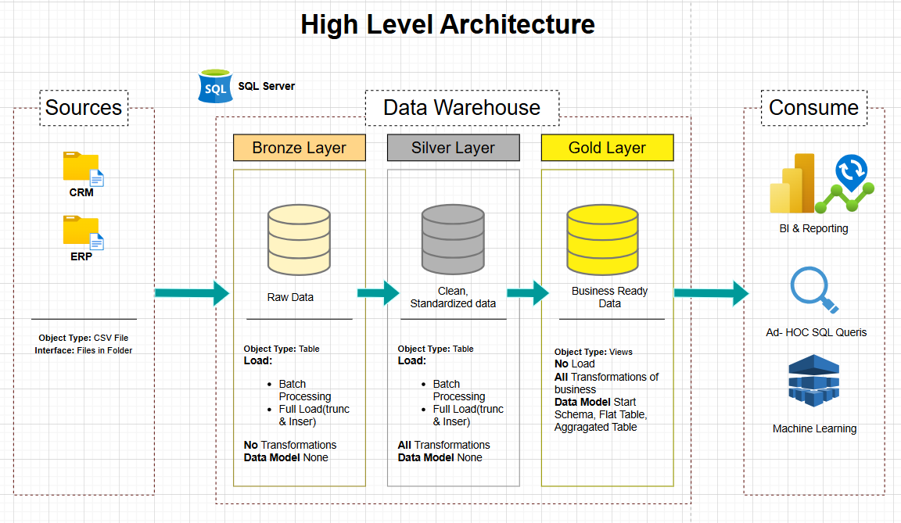

# Data Warehouse

Welcome to the **Data Warehouse** repository! 🚀  
This project demonstrates a comprehensive data warehousing pipeline, from building a data warehouse to generating actionable insights. It highlights industry best practices in data engineering and analytics.

---

---

## 🏗️ Data Architecture

The data architecture follows Medallion Architecture with **Bronze**, **Silver**, and **Gold** layers:

1. **Bronze Layer**: Stores raw data as-is from source systems. Data is ingested from CSV files into SQL Server.  
2. **Silver Layer**: Cleansing, standardization, and normalization processes prepare data for analysis.  
3. **Gold Layer**: Business-ready data modeled into a star schema for reporting and analytics.

---

## 📖 Project Overview

This project involves:

1. **Data Architecture**: Designing a modern data warehouse with Bronze, Silver, and Gold layers.  
2. **ETL Pipelines**: Extracting, transforming, and loading data from source systems.  
3. **Data Modeling**: Developing fact and dimension tables optimized for analytical queries.  
4. **Analytics & Reporting**: Creating SQL-based reports and dashboards for actionable insights.

This repository demonstrates skills in:

- SQL Development  
- Data Architecture  
- ETL Pipelines  
- Data Modeling  
- Data Analytics  

---

## 🚀 Project Requirements

### Building the Data Warehouse (Data Engineering)

**Objective:**  
Develop a modern data warehouse using SQL Server to consolidate data for analytical reporting and decision-making.

**Specifications:**

- **Data Sources:** Import data from CSV files representing multiple systems.  
- **Data Quality:** Cleanse and resolve data quality issues prior to analysis.  
- **Integration:** Combine sources into a single data model designed for analytical queries.  
- **Documentation:** Provide clear documentation of the data model to support business and analytics teams.

---

